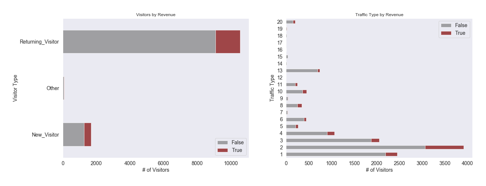
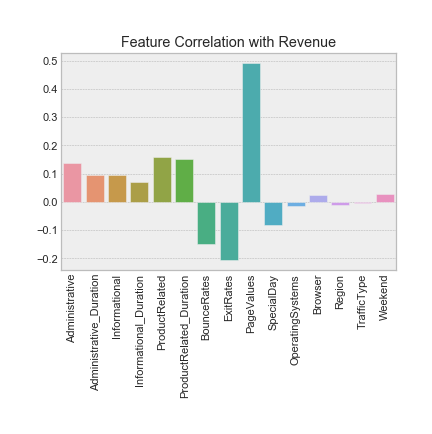

# E-commerce Customer Purchase Intentions

## Repository Contents

- `notebooks`: folder containing draft notebooks with modeling process
    - `d_tree_model.ipynb`: draft notebook for decision tree and random forest model iteration
    - `log_reg_model-BASELINE & BALANCED.ipynb`: draft notebook for baseline & balanced logistic regression model iterations
    - `log_reg_model-SMOTE.ipynb`: draft notebook for logistic regression model using SMOTE for class imbalance
- `visualizations`: folder containing all visualzations generated in `eda_notebook.ipynb`
- `.ipynb_checkpoints`: folder containing Jupyter Notebook checkpoints, can disregard
- `eda_notebook.ipynb`: notebook with exploratory data analysis (EDA) process
- `business_insights`: notebook with final visualizations that answer the business problems
- `final_model.ipynb`: notebook with modeling process for final model that recieved the highest evaluation metric
- `online_shoppers_intention.csv`: .csv file with original research data from UCI
- `model_data.csv`: .csv file with data cleaned within `eda_notebook.ipynb`
- `README.md`: markdown file to display README on repository

## Overview

The `online_shoppers_intention.csv` includes 12,330 sessions of online traffic to an unknown website over the period of a year. The column 'Revenue' contains a True or False value that displays whether or not a website viewer purchases the product. This serves as the target variable for the clasification problem. Using the other columns provided, we can create a classification model that can predict whether a site visitor will purhase the product. The company can use this model for future use.

The primary evaluation metric will be Recall because it indicates the amount of true positives that the model predicts. In this business context, false negatives are intolerable because that would inaccurately represent sales. We will also be looking at F1 score and AUC score because they have a direct relationship with Recall; espeically AUC as it predicts the probability of true positives.

## Primary Business Problem

How can the company increase conversion among customers who visit the website?

From the distrbution of 'Revenue' in this dataset, it's clear that 85% of people who visited the website that year did not convert to a customer. To solve this problem, we'll investigate what factors impact this decision.

## Business Questions

1. How does the number of visitors differ each month?
2. Do returning visitors have a higher revenue than one-time visitors?
3. What feature has the highest influence on revenue?

## Data & Methods

This project uses the [Online Shoppers Purchasing Intention Dataset](https://archive.ics.uci.edu/ml/datasets/Online+Shoppers+Purchasing+Intention+Dataset#) from the UCI Machine Learning Repository.

The research study gathered data from each session of website traffic over the 1-year period. The 'Revenue' column was used as the target variable in this classification project. Below is a description of each column in the original dataset.

| Column Name | Description |
|-|-|
| **Administrative** | Administrative Page Value |
| **Administrative_Duration** | Duration in Administrative Page |
| **Informational** | Informational Page Value |
| **Informational_Duration** | Duration in Informational Page |
| **ProductRelated** | Product Related Page Value |
| **ProductRelated_Duration** | Duration in Product Related Page |
| **BounceRates** | Visitors who enter the site from that page and leave without visiting any other pages. |
| **ExitRates** | Calculated with all page views before exiting the website. |
| **PageValues** | Average value for a web page that a user visited before completeing an e-commerce transaction. |
| **SpecialDay** | Promximity to site visit to specific special day (e.g. Mother's Day, Valentine's Day) in which the sessions are more likely to be finalized with transaction. |
| **Month** | Month of the year |
| **OperatingSystems** | Operating system used |
| **Browser** | Internet browser used |
| **Region** | Region of the user |
| **TrafficType** | Traffic Type |
| **VisitorType** | Returning visitor or not |
| **Weekend** | Weekend or not |
| **Revenue** | Whether revenue was generated or not, as True or False |

## Results

- Promote the site during these peak months, focusing on spring up until early summer.

- Because a majority of purchasers are returning visitors, focus advertising efforts towards people who have already viewed the site to encourage them to return and convert to a customer.

- Since Page Value is a metric goal set by the company, this is the most crucial feature to focus on. Because the higher the page value, the higher the chance that they'll transact, meaning they viewed more pages.

## Final Model Performance

Our final model will be the Decision Tree with `max_depth=3` and `class_weight=balanced`. Even though it had a worse recall the the RFECV model, this one is not as overfit. Therefore, it is ideal for testing on unseen data.

We tried performing grid search with cross validation to optimize other hyperparameters, but they perform almost exactly the same as this model.

## Next Steps
- Collect more data, but include a legend for categorical variables to promote interpretability.
- Webscrape simliar data from other e-commerce stores within the industry to see how the model performs with that blind data.
- A/B Testing the web design of the prominence of Adminstrative and Informational page links to increase length of user session.